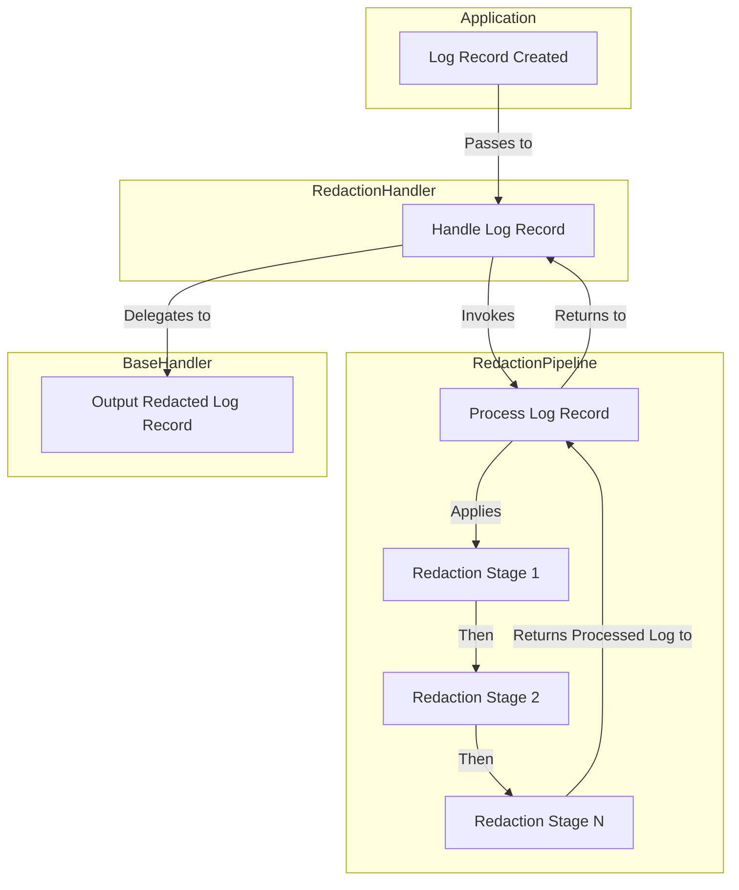

# redact

A Go package for redacting sensitive information from slog-based logs using a configurable pipeline.

```mermaid
flowchart TD
    subgraph Application
        A[Log Record Created]
    end

    subgraph RedactionHandler
        G[Handle Log Record]
    end

    subgraph RedactionPipeline
        direction TB
        C[Process Log Record]
        D[Redaction Stage 1]
        E[Redaction Stage 2]
        F[Redaction Stage N]
    end

    subgraph BaseHandler
        direction TB
        H[Output Redacted Log Record]
    end

    A -->|Passes to| G
    G -->|Invokes| C
    C -->|Applies| D
    D -->|Then| E
    E -->|Then| F
    F -->|Returns Processed Log to| C
    C -->|Returns to| G
    G -->|Delegates to| H
```
