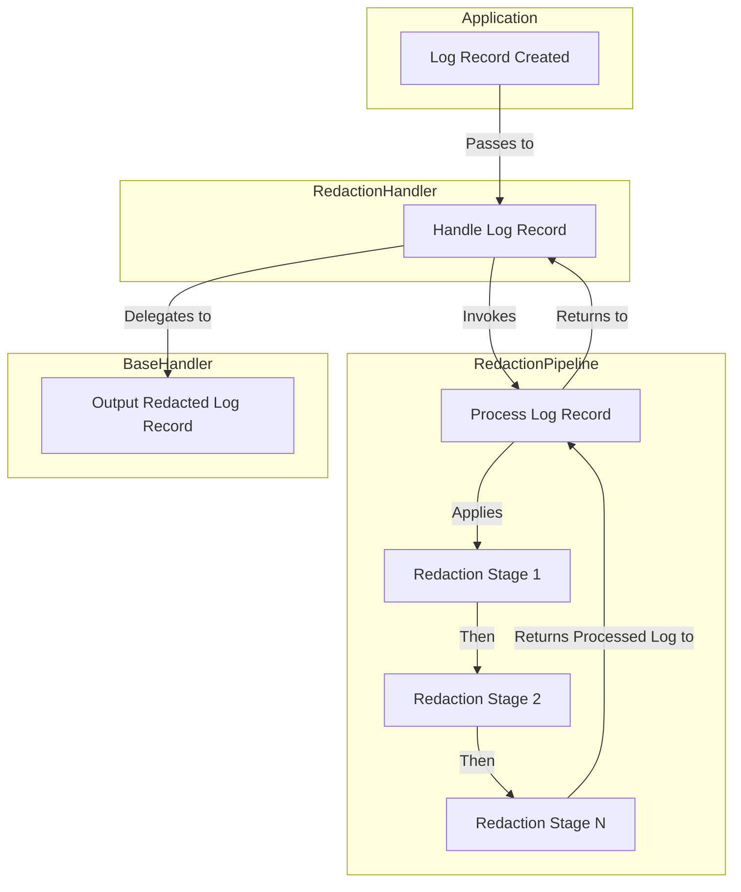

# redact

[](https://codecov.io/gh/alesr/redact)
[](https://goreportcard.com/report/github.com/alesr/redact)
[](https://pkg.go.dev/github.com/alesr/redact)

A Go package for redacting sensitive information from slog-based logs using a configurable pipeline.

## Overview

The `redact` package provides a way to redact sensitive information from logs generated by the `slog` package. It does so by creating a pipeline of redaction stages that can be configured to redact specific fields from the log records.



## Usage

```go
package main

import (
	"log/slog"
	"os"

	"github.com/alesr/redact"
)

func main() {
	// Create a base handler
	handler := slog.NewTextHandler(os.Stdout, nil)

	// Create a redaction pipeline
	pipeline := redact.NewRedactionPipeline()
	pipeline.AddRedactField("email")
	pipeline.AddRedactField("password")

	// Create a RedactionHandler that wraps the original handler
	redactionHandler := redact.NewRedactionHandler(handler, pipeline)

	// Create a logger with the RedactionHandler
	logger := slog.New(redactionHandler)

	logger.Info("Test log", slog.String("user", "rigoletto"), slog.String("email", "foo@bar.qux"), slog.String("password", "abc123"))
}

// Output: time=2025-02-08T19:49:23.826+02:00 level=INFO msg="Test log" user=rigoletto email=[REDACTED] password=[REDACTED]
```

Check the [examples](examples) directory for a testable example.

## Documentation

https://pkg.go.dev/github.com/alesr/redact
